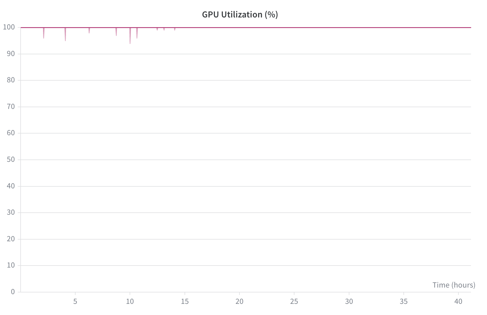
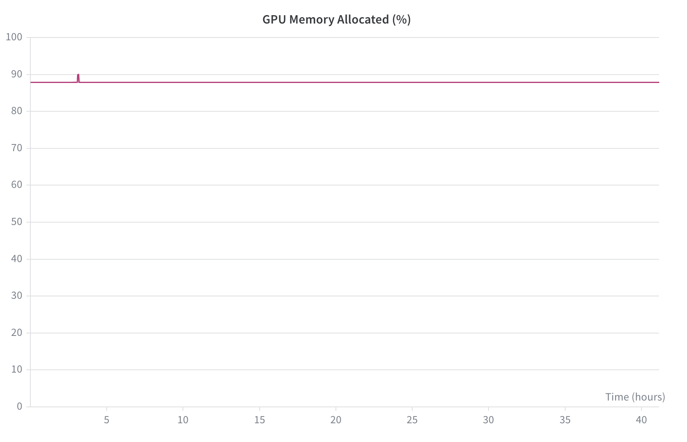
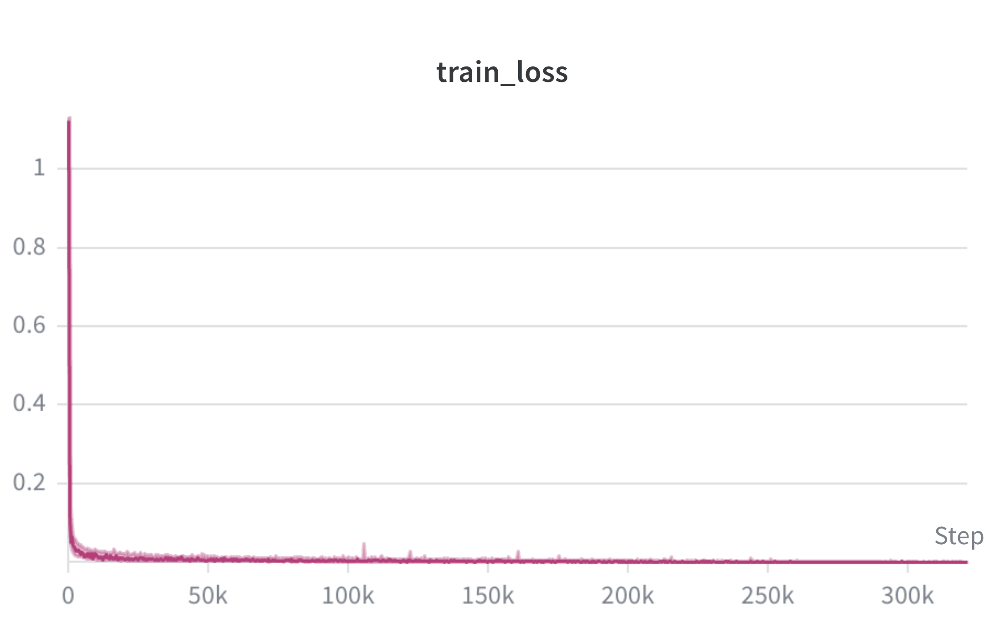

# SoTa: Soft Tactile Skins for Dexterous Manipulation

**PI:** Jeannette Bohg
**Group member SUNet IDs:** [TBD: SUNet IDs]

## Abstract

Contact-rich dexterous manipulation needs fine-grained tactile feedback that vision alone cannot supply, yet tactile data is hard to scale because human and robot hands rarely share a sensor layout that lets demonstrations transfer across embodiments. SoTa closes this gap with low-cost tactile skins that place 202 semantically aligned taxels on both human and robot hands, enabling paired visuo-tactile demonstrations and cross-embodiment co-training. Validating the approach means training a visuo-tactile policy across data-composition regimes and tasks, sweeping the fraction of human data under a fixed robot-data budget. The study spans seven method variants over ten tasks, with three-day jobs repeated across five iterations, requiring roughly 3,600 H100 GPU-hours, plus an optional follow-up of similar size on in-the-wild human data. Marlowe provides the sustained, high-utilization H100 capacity these concurrent multi-day runs require.

## Scientific Overview

Vision-based imitation learning has driven recent progress in robot manipulation, scaled by large in-the-wild teleoperation datasets [1, 2] and cross-embodiment training [3]. Contact-rich manipulation depends on signals vision captures poorly, such as contact force, slippage, and surface conformation, and tactile sensing has been shown to supply them on multifingered hands [4]. The bottleneck is sourcing tactile data at scale: most tactile datasets are robot-only and embodiment-specific, cut off from the larger pool of human manipulation behavior that wearable tactile gloves have begun to capture [5]. Prior efforts to bridge human and robot tactile signals rely on shared sensors with mechanical or learned alignment [6, 7], which trade off coverage or fidelity. SoTa instead fixes one semantic taxel layout across both hands, so human and robot demonstrations enter training without a learned alignment step. The dataset holds 770 human and 269 robot demonstrations across five contact-rich tasks (box closing, cloth folding, pepper placement, cup picking, board wiping), with synchronized egocentric RGB and proprioception at 30 Hz.

## Prior Experience

Our group routinely operates SLURM-managed GPU clusters across Stanford research compute infrastructure, Google Cloud, and lab servers, and runs multi-day distributed training as a matter of course. The SoTa visuo-tactile policy pipeline is implemented and already produces physical-robot evaluation results on two of the five target tasks (cloth folding and pepper placement). We profile jobs early, tune batch size and data loading before scaling, and monitor GPU utilization, memory, and throughput throughout training. Checkpointing supports clean pause and resume so long runs survive interruption. The stack is standard PyTorch, which the team uses daily for policy training on managed clusters.

## Computational Readiness

We profiled the SoTa training pipeline on RTX 6000 GPUs (50 GB memory), packing four training jobs onto a single GPU. The pipeline holds GPU utilization near 100 percent for the full run, with only brief transient dips (Figure 1), and allocates a stable 88 percent of GPU memory throughout (Figure 2). Training loss falls sharply within the first few thousand steps and stays converged past 300k steps (Figure 3), confirming a stable, compute-bound regime that leaves little memory idle.

These measurements set the H100 plan. Four concurrent jobs fill about 88 percent of a 50 GB card, near 11 GB per job, so an 80 GB H100 can host seven concurrent jobs. This lets us pack the seven training methods for one task onto a single H100, which is the unit our compute estimate is built on. Each job runs on one GPU, so throughput scales by running more GPUs in parallel rather than by splitting a job across GPUs.

*Figure 1. GPU utilization during a SoTa profiling run on RTX 6000, sustained near 100 percent with brief transient dips.*

*Figure 2. GPU memory allocated during the same run, stable near 88 percent of the 50 GB card with four packed jobs (about 11 GB per job).*

*Figure 3. Training loss versus step, converging within the first few thousand steps and staying stable past 300k steps.*

## Computational Profile

The core study packs the seven method variants for one task onto a single H100, with each packed job running about three days. Ten tasks therefore occupy ten H100 GPUs concurrently for roughly three days, which is 720 GPU-hours per iteration. Across five iterations of data refinement and retraining, the core study needs about 3,600 H100 GPU-hours. An optional experiment that mixes robot data with task-specific and in-the-wild human data adds up to 720 GPU-hours per iteration, for a combined upper bound near 7,200 H100 GPU-hours.

Peak concurrency is about ten H100 GPUs during a sweep, each hosting seven packed jobs. Per-job GPU memory is near 11 GB, measured on RTX 6000 and expected to hold on H100. Jobs are compute-bound during training with moderate I/O during data loading. Host CPU and RAM per job: [TBD: CPU cores and system RAM per job for the SoTa pipeline].

## Justification for Marlowe

Our lab servers do not provide H100-class GPUs, so any experiment needing H100 memory or throughput cannot run there. Cloud H100 capacity is available but cost-prohibitive at the 3,600 to 7,200 GPU-hour scale we plan, especially with many independent multi-day jobs running at once. Shared Stanford partitions accessible to our group see contention that breaks the multi-day stability our jobs need. Marlowe supplies what these options do not: enough concurrent H100 capacity to run a ten-GPU sweep without serializing it, the 80 GB per card that lets us pack seven jobs per GPU, and stable scheduling for multi-day runs. That combination of volume, memory, and uptime is the bottleneck Marlowe removes.

## Technical Requirements and Feasibility

All dependencies are open-source and pip-installable. Training runs on a standard PyTorch environment with CUDA and needs no containers, proprietary software, or non-standard kernels beyond the H100 GPUs themselves. The SoTa code will be open-sourced on publication. Development repository: [TBD: GitHub URL].

## Storage and Data

The dataset holds 1,039 episodes (770 human, 269 robot) across five contact-rich tasks, each with synchronized egocentric RGB, proprioception, and bilateral tactile readings at 30 Hz over 202 taxels per hand. Total duration is reported inconsistently in the current paper draft (about 2.5 hours in the dataset analysis versus about 6 hours elsewhere) and will be reconciled before the sweep. Data is staged to cluster scratch by direct download or rsync. Training jobs checkpoint regularly and support pause and resume. Scratch capacity required: [TBD: scratch storage for raw plus processed data and checkpoints]. Per-checkpoint size: [TBD: checkpoint size for the SoTa policy].

## Impact and Acknowledgements

This project targets a core barrier in robot learning: the lack of scalable cross-embodiment tactile data for contact-rich manipulation. Showing that layout-aligned human tactile demonstrations improve robot policies under a fixed robot-data budget would give a practical recipe for scaling tactile learning past the limits of robot teleoperation. We plan to submit to a top robot-learning venue, currently CoRL 2026, with the underlying paper [8] in draft, and to open-source the code, models, and dataset.

## References

[1] A. Khazatsky, K. Pertsch, S. Nair, A. Balakrishna, S. Dasari, S. Nasiriany, et al., "DROID: A Large-Scale In-the-Wild Robot Manipulation Dataset," arXiv:2403.12945, 2024.

[2] Z. Fu, T. Z. Zhao, C. Finn, "Mobile ALOHA: Learning Bimanual Mobile Manipulation with Low-Cost Whole-Body Teleoperation," arXiv:2401.02117, 2024.

[3] Q. Vuong, S. Levine, H. R. Walke, K. Pertsch, A. Singh, R. Doshi, et al., "Open X-Embodiment: Robotic Learning Datasets and RT-X Models," Towards Generalist Robots Workshop at CoRL, 2023.

[4] H. Qi, B. Yi, S. Suresh, M. Lambeta, Y. Ma, R. Calandra, J. Malik, "General In-Hand Object Rotation with Vision and Touch," Conference on Robot Learning (CoRL), 2023.

[5] S. Sundaram, P. Kellnhofer, Y. Li, J.-Y. Zhu, A. Torralba, W. Matusik, "Learning the Signatures of the Human Grasp Using a Scalable Tactile Glove," Nature, vol. 569, no. 7758, pp. 698 to 702, 2019.

[6] J. Yin, H. Qi, Y. Wi, S. Kundu, M. Lambeta, W. Yang, C. Wang, T. Wu, J. Malik, T. Hellebrekers, "OSMO: Open-Source Tactile Glove for Human-to-Robot Skill Transfer," arXiv:2512.08920, 2025.

[7] Y. Wi, J. Yin, E. Xiang, A. Sharma, J. Malik, M. Mukadam, N. Fazeli, T. Hellebrekers, "TactAlign: Human-to-Robot Policy Transfer via Tactile Alignment," arXiv:2602.13579, 2026.

[8] [TBD: Final citation for the CoRL 2026 SoTa paper draft].

---

<!-- MISSING INPUTS

TBDs:
- Project & PI: Group member SUNet IDs
- Project & PI: confirm PI is Jeannette Bohg (inferred from lab affiliation and template)
- Computational Profile: CPU cores and system RAM per job for the SoTa pipeline
- Technical Requirements: GitHub repo URL for the SoTa codebase
- Storage and Data: scratch storage capacity (raw + processed data + checkpoints)
- Storage and Data: per-checkpoint size for the SoTa policy
- References: final citation for the CoRL 2026 SoTa paper draft (reference [8])

Figures included (real, from the project folder):
- Figure 1: GPU_Utilization.png (RTX 6000, near-100% utilization)
- Figure 2: GPU_memory.png (stable ~88% memory, 4 packed jobs)
- Figure 3: train_loss.png (convergence within first few thousand steps)

Changes from v2 (DreamZero / world-model content removed):
- Removed all references to the DreamZero pipeline, world/action models, and 3-8B-parameter models. The CoRL SoTa project is a visuo-tactile Diffusion Policy, not a world model; the inherited claims in project_info.txt did not apply.
- Replaced the inherited DreamZero profiling numbers (~86% utilization, ~80 GB VRAM, ~3-day convergence) with the real SoTa profiling plots measured on RTX 6000.
- Removed the multi-node 16-GPU framing (it came from the world-model proposal). SoTa jobs run on a single GPU; concurrency comes from running many GPUs in parallel, not from multi-GPU jobs.
- Marked storage and checkpoint sizes as TBD. The inherited 100 TB scratch and 20 GB per-checkpoint figures came from a video world-model project and are almost certainly wrong for a Diffusion Policy over 1,039 episodes; real SoTa numbers are needed.

Open questions for the author:
- Reconcile dataset duration (about 2.5 hours in the dataset analysis vs about 6 hours in abstract/intro) before submission.
- Confirm the "10 contact-rich tasks" framing vs the 5 tasks currently in the draft. The GPU-hour math uses 10 tasks per computation_details.txt (noted there as an acceptable overestimate for the proposal).
- Provide real SoTa scratch-storage and checkpoint-size estimates to replace the TBDs.
- Provide CPU cores and RAM per job, if known, or confirm leaving them unspecified.
- Confirm urgent timelines (grant or conference deadlines) for Section 1 of the application form.

-->
